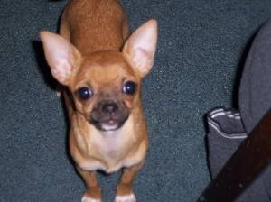
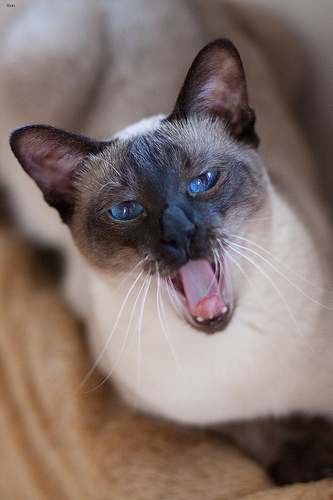

# Columbia University, Department of Statistics STAT GU4243 Applied Data Science, Spring, 2018
# Project 2: Cat or Dog: Predictive Modelling and Computation Time Optimization

### [Project Description](doc/project2_desc.md)

Term: Spring 2018

+ Project title: Cat or Dog: Predictive Modelling and Computation Time Optimization
+ Team Number: 6
+ Team Members: Wanting Cheng, Mingkai Deng, Jiongjiong Li, Kai Li, Daniel Parker
+ Project summary: [a short summary] 

This folder is organized as follows.

### Project and Data Description

The Project aims to improve the baseline model which is sift feature + BGM model.

#### Data Description
In the training data, 2000 raw pictures including dogs and cats with labels. 

### Feature selection
We choose to generate four kinds of features: HOG, LBP, color, and SIFT. 
+ SIFT: Scale-Invariant Feature Transform (SIFT): Generate key points that describe images irrespective of scale, rotation, illumination or viewpoints. Each key point is described by a 128x1 vector. To utilize these points, we group them using k-means algorithms, and then use the bag-of-words approach to aggregate them and transform them into feature vectors.
+ Histogram of Oriented Gradients(HOG): HOG denotes the Histogram of Oriented Gradient. It extracts features by investigating the appearance and shape, computing the targets' HOG values and finding the statistic data of gradients.
+ Local Binary Patterns (LBP): is a typical visual descriptor used for computer vision. It divides the window into cells. For each cell, the center cells compared with other 8 cells around and generate an 8-digit binary number that "0" means the center is greater than the neighbors' value and "1" otherwise. Then compute the frequency of different combination for each cell. Then normalized histograms of all cells. 
+ Color (RGB+HSV): 
 + RGB: The color for each cell is defined by three chromaticities combination of Red, Green and Blue. Produce the matrix representing the possible value of color. 
 + HSV: is an alternative representation of RGB features. The color of each hue is central axis of natural color ranging from black to white. The value of dimensions represents the various shades of brightly and a mixture of paints with varying amount of black or white.

### We choose fix models:
+ Gradient Boosting Machine (GBM): GBM is used to regression and classification problems, and it produces the model by allowing optimization of an arbitrary differentiable loss function. The algorithm is building a strong model based on many weaker ones sequentially by optimizes a cost function over function space by choosing the function that points that in the negative gradient direction. 
+ Random Forest (RF): RF is constructing a multitude of decision trees at training and output of the classes of the individual trees.
+ Neural Network (NN): NN uses the system "learn" to improve the performance based on examples without task-specific programming. NN is based on a collection of connected units. For each connection, data is transformed into signal between connection and units, and the output of each unit is calculated a non-linear function of the sum of inputs. 
+ AdaBoost (Ada): Ada is usually less susceptible to the overfitting problem, and the process is selecting features improved the predictive power of the model in order to reduce dimensionality and execution time. 
+ XGBoost (XGB): XGB is an importer of GBM, and XGB is used a more regularized model formalization to control over-fitting, which gives it better performance.
+ Support Vector Machine SVM: SVM has mapped the examples of the separate categories are divided by a clear gap to separate into two classes. 

### Outcomes
The following table shows the accuracy and training time corresponding to different models and features.

### Findings
Find:
Cats are hard to be predicted, 50% of cats are misclassified. 
The results are not as good as we thought by trying different models and features. The potential problem is the feature is not good enough because our features are focusing on the structure of the dogs or cats. However, the general structure of cats or dogs is pretty similar.
Convolutional Neural Network might give us better features, but it is very time-consuming. Thus, we give up this method considering the size of testing data and limited time. 

### Contribution
Wanting Chen:   fearure(color, LBP), model(SVM), Final Code writeup
Mingkai Deng:   feature(SIFT), Final Code writeup, slides
Jiongjiong Li:  feature(HOG), model(GBM, Adaboost, XGBoost), Final Code writeup
Kai Li:         model(Neural Network, kNN(not used)), rotation image features, Final Code writeup, Readme
Daniel Parker:  model(Random Forest), slides, project meeting organization

